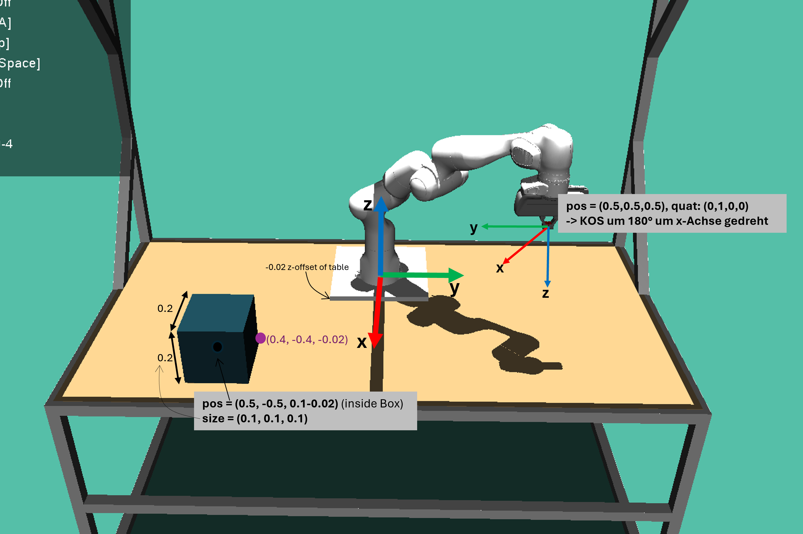
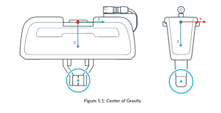
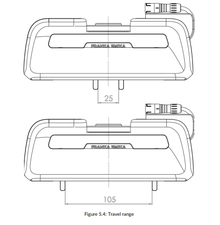

# ALRSimulationTools
This Repo contains a set of utilities that allow for quick and easy test setups for the `ALR simulation framework` as well as utilities for connecting to ROS services provided by the `grasping-benchmak-panda` repository.
It aims to collect the most commonly used utilities in a single place.
The notebooks provide a variety of examples for common use cases.

## Installation/Setup (and why no Devcontainern is used yet) 
The visualization of the simulation is not easy to realize when running the simulation in a devcontainer.
As this repo is mainly for testing and developing a graphical user interface for the simulation is quite important.
Therefore an install script is provided that installs the required dependencies in a new conda environment.
This script installs ROS noetic voa the robostack conda channel as well as the ALRSimulationFramework and this package. 
The script does _not_ install the old MuJoCo version for the Simulationframework. Therfore it is not necessary to download the mujoco files from the mujoco website manually.

`bash install.sh <path-to-alrs-SimulationFrameowkr> <name-of-the-conda-env-to-create>`

## Communincation with ROS service in grasping-benchmark-panda
To send service requests to the algorithm services in grasping-benchmark-panda repository the Message and Service definitions from the grasping-banchmark-panda ROS package need to be available.
To avoid an additional build of the ros package the message and service definitions have been copied into this repo. (`alr_sim_tools/ros_msg_srv_definitions`)

## Coordinate Sysemes and Dimensions
In the beginning the coordinate systems used in the ALR simulation framework can be a bit confusing.
The image below tries to give some clarity on the different coordinate systems used in the ALR simulation framework as well as a feeling of the scale of the environment.

Note that the origin of the world coordinate system is offset from the table top by 0.02m in z direction.
This means that the table top is at z=-0.02m in the world coordinate system.
This might be relevant when placing objects or moving the robot to a certain position.

Also note that the position of the gripper refers to the center point of the gripper fingers.
The meaning of "center of the gripper fingers" is visualized in the second image as the blue point in the middle of the gripper fingers (not the coordinate system origin of the gripper).

Another caveat refers to the dimensions of boxes. 
The side length of a box is actually two times the value provided in the `size` argument.
The position of the box refers to its center point.

### Gripper Dimensions
Sometimes the exact dimensions of the gripper are important.
Below are the most important technical drawings taken from the [Franka Emika Panda gripper manual](https://download.franka.de/documents/220010_Product%20Manual_Franka%20Hand_1.2_EN.pdf).

## Speeding Up Testing with saved Simulation States
The main bottleneck when it comes to testing the wrapped grasping algorithms is the time it takes the simulation to capture the data and execute the grasp.
While the process of capturing the data can be elimintad by using prerecorded data (e.g. pickled or custom serialized data) the execution of the grasp still has to be done each time to determine the success of the grasp.
The usage of serialized simulation data comes with quite some overhead implementation wise (which format to use? how to (de)serialize?) and at the same time the capturing of the data has been speed up by beaming to the home position.
Therfore for now it is not planned to use serialized simulation data as the main botlleneck is the execution of the grasp.

